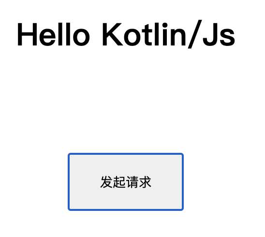

# Kotlin/Js-Spring Sample

**Kotlin多平台演示** 

Kotlin/Js(前端) + Kotlin/SpringWebFlux(后端)

### 1、初始化

##### 1、本地添加**local.properties**文件

> 文件内容
importJs=false #启动server时是否引入dashboard工厂，默认false，分离开发时设置为false提高编译速度

##### 2、环境配置

- 开发环境：<kbd>Modules Setting</kbd> > <kbd>Project</kbd> > <kbd>Project SDK</kbd> > <kbd>设置为Java1.8</kbd>

- 编译环境：<kbd>Preferences</kbd> > <kbd>Build, Execution, Deployment</kbd> > <kbd>Build Tools</kbd> > <kbd>Gradle</kbd> > <kbd>Build and run using 和 Run tests using</kbd> > <kbd>设置为Gradle (Default)</kbd>

- Java 1.8
- Kotlin 1.4.10
- Gradle 6.6.1-All

其他看build.gradle

##### 3、启动

**importJs为True**

- 启动SampleServerApplication
- Dashboard：http://localhost:9511/dashboard
- 服务接口：http://localhost:9511/home/items

**如果Dashboard独立启动**

- 执行<kbd>dashboard tasks</kdd> > <kbd>kotlin browser</kdd> > <kbd>browserDevelopmentRun</kdd>
- http://localhost:8080

##### 4、测试

使用server/src/test/http/homeClient.http请求测试

### 2、异常情况

> 如果启动Spring出现java.lang.NoClassDefFoundError: com/xy/kotlin/sample/server/error/ServerException
可以尝试使用**Invalidate Caches/ Restart**清除Idea缓存，然后使用**tasks/build/clean**清除工程缓存后重试

这个应该是kotlin-multiplatform的Bug，在切换分支后残留的缓存文件导致

### ∞、其他

> [热加载](https://kotlinlang.org/docs/tutorials/javascript/dev-server-continuous-compilation.html) Arguments添加--continuous

##### 1、参考资料

- [Kotlin/Js官方示例](https://play.kotlinlang.org/hands-on/Building%20Web%20Applications%20with%20React%20and%20Kotlin%20JS/01_Introduction)
- [Kotlin多平台官方示例](https://play.kotlinlang.org/hands-on/Full%20Stack%20Web%20App%20with%20Kotlin%20Multiplatform/01_Introduction)
- [Kotlin/Js官方文档](https://www.kotlincn.net/docs/reference/js-project-setup.html)
- [React官方文档](https://zh-hans.reactjs.org/tutorial/tutorial.html#making-an-interactive-component)
- [MaterialUi官方文档](https://material-ui.com/zh/getting-started/usage/)

##### 2、引用库

- [spring-framework](https://github.com/spring-projects/spring-framework) SpringWebflux
- [spring-boot](https://github.com/spring-projects/spring-boot) SpringBoot
- [kotlin-wrappers](https://github.com/JetBrains/kotlin-wrappers) Kotlin React包装库
- [kotlin-material-ui](https://github.com/subroh0508/kotlin-material-ui) Kotlin Material-Ui包装库
- [kotlinx.serialization](https://github.com/Kotlin/kotlinx.serialization) Kotlin 解析器
- [ktor](https://github.com/ktorio/ktor) Kotlin官方开发框架，这里只用了Kotlin/Js Client部分
- [kotlin-logging](https://github.com/MicroUtils/kotlin-logging) Kotlin日志
